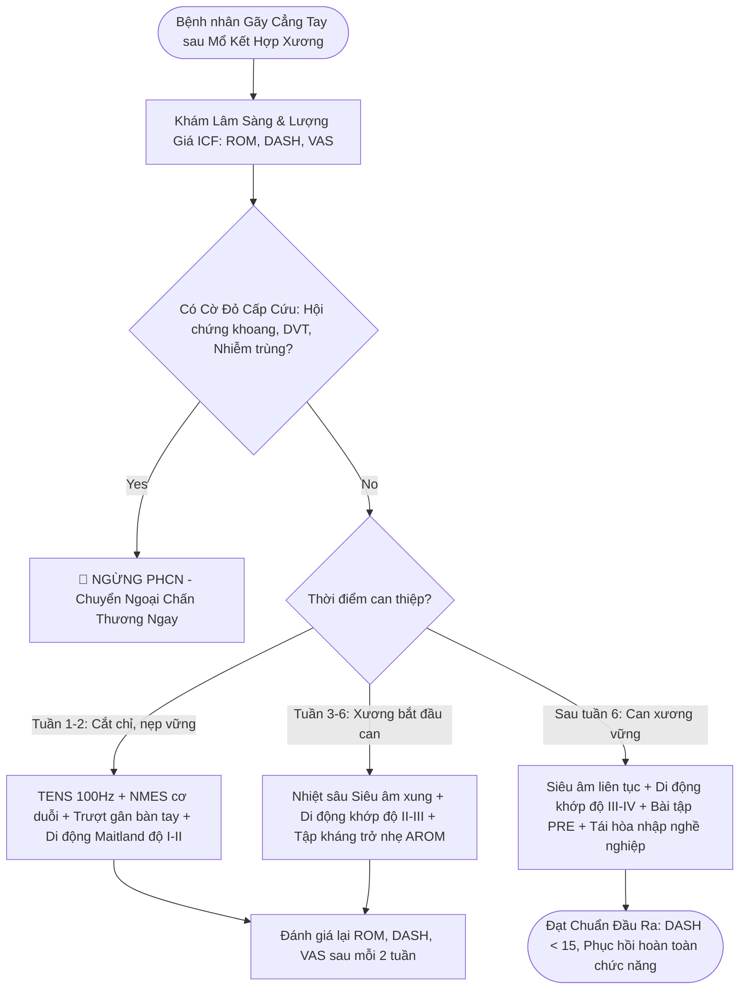

# BÀI GIẢNG 2: QUY TRÌNH LƯỢNG GIÁ TOÀN DIỆN VÀ KÊ ĐƠN PHỤC HỒI CHỨC NĂNG GÃY XƯƠNG CẲNG TAY

**Đối tượng học tập:** Bác sĩ Y khoa (Bậc 7 VQF) & Bác sĩ Sau đại học (BSNT, CKI, ThS - Bậc 8 VQF)  
**Khung pháp lý:** Quy trình Kỹ thuật Chuyên ngành PHCN Bộ Y tế Việt Nam 2024–2025; Luật Khám bệnh, chữa bệnh 2023.  
**Chuẩn sư phạm:** Case-Based Learning (NUS Medicine) & Khung ICF (WHO).

---

## 1. TÌNH HUỐNG LÂM SÀNG MỎ NEO (ANCHOR CLINICAL CASE)

* **Hành chính:** Bệnh nhân nữ, 52 tuổi, giáo viên tiểu học.
* **Lý do vào viện:** Hạn chế vận động cổ tay và bàn tay phải sau phẫu thuật kết hợp xương gãy đầu dưới xương quay.
* **Bệnh sử:** Bệnh nhân bị trượt ngã chống tay phải, được chẩn đoán gãy đầu dưới xương quay di lệch (gãy Colles) kèm gãy mỏm trâm trụ. Đã phẫu thuật kết hợp xương nẹp vít khóa mặt gan tay (Volar Locking Plate) cách đây 14 ngày. Hiện đã cắt chỉ vết mổ, vết mổ khô liền sẹo tốt.
* **Lượng giá chức năng ban đầu (Theo mô hình ICF):**
  - *Cấu trúc & Chức năng cơ thể ($b/s$):* Đau khớp cổ tay khi cử động (VAS 5/10); Tầm vận động cổ tay chủ động: Gấp $25^\circ$ (bình thường $80^\circ$), Duỗi $30^\circ$ (bình thường $70^\circ$), Sấp $40^\circ$ (bình thường $85^\circ$), Ngửa $35^\circ$ (bình thường $90^\circ$); Sức mạnh cơ nắm bàn tay bằng lực kế: $8	ext{ kg}$ bên phải vs $24	ext{ kg}$ bên trái; Phù nề bàn tay đo theo phương pháp số 8 (Figure-of-eight) tăng $1.8	ext{ cm}$ so với tay lành.
  - *Giới hạn hoạt động ($d$):* Khó khăn khi viết bảng, cầm bút, cài khuy áo, mở nắp chai nước.
  - *Hạn chế tham gia ($d$):* Tạm thời nghỉ dạy học trên lớp.
  - *Chỉ số khuyết tật chi trên:* Điểm số DASH ban đầu = 68/100 (Khuyết tật mức độ nặng).

---

## 2. KÊ ĐƠN PHỤC HỒI CHỨC NĂNG CHI TIẾT (REHABILITATION PRESCRIPTION)

> [!IMPORTANT]
> **Đối chiếu Quy trình Kỹ thuật Bộ Y tế (2024–2025):** Bác sĩ PHCN khám, lượng giá và ký y lệnh điều trị; Kỹ thuật viên PHCN trực tiếp thực hiện quy trình và theo dõi người bệnh.

### 2.1. Đơn Điện Trị Liệu Giảm Đau (TENS)
* *Chỉ định:* Giảm đau vùng cổ tay sau cắt chỉ.
* *Thông số kỹ thuật:* 
  - Dạng dòng: Xung chữ nhật 2 pha cân đối (Symmetrical Biphasic).
  - Tần số ($f$): $100	ext{ Hz}$.
  - Độ rộng xung ($t$): $80\ \mu s$.
  - Cường độ ($I$): Điều chỉnh tăng dần đến ngưỡng tê rần mạnh nhưng dễ chịu, tuyệt đối không gây co cơ.
  - Điện cực: Đặt 2 bản cực đối xứng ôm lấy vùng khớp cổ tay mặt gan và mu tay.
  - Thời gian: 30 phút/lần, 1 lần/ngày. [PEDro 8/10, Mức 1a].

### 2.2. Đơn Kích Thích Thần Kinh - Cơ Chống Teo Cơ (NMES)
* *Chỉ định:* Ức chế phản xạ cơ duỗi cổ tay và cơ duỗi chung các ngón do đau và bất động.
* *Thông số kỹ thuật:*
  - Dòng điện: Dòng Biphasic hoặc Russian (tần số sóng mang 2500 Hz ngắt quãng ở 50 Hz).
  - Độ rộng xung: $300\ \mu s$.
  - Chu kỳ co/nghỉ: Co 6 giây, nghỉ 18 giây (Tỷ lệ 1:3). Thời gian dốc (ramp up) 1.5 giây.
  - Cường độ: Đạt mức co cơ nhìn thấy rõ (co cơ đẳng trường cổ tay ở tư thế trung gian).
  - Vị trí: Đặt trên điểm vận động cơ duỗi cổ tay quay dài/ngắn (ECRL/ECRB).
  - Thời gian: 15 phút/lần, ngày 1 lần.

### 2.3. Đơn Vận Động Trị Liệu & Di Động Khớp
* *Di động khớp (Maitland):* Di động khớp quay trụ dưới (DRUJ) và khớp quay cổ tay mức độ I - II (dao động biên độ nhỏ/lớn trong tầm không đau) để giảm đau và kích thích tuần hoàn hoạt dịch.
* *Bài tập vận động:*
  - Tập trượt gân bàn tay (Tendon gliding exercises) theo 5 tư thế (Straight, Hook, Fist, Tabletop, Straight fist) tránh dính gân gấp quanh vết mổ nẹp vít.
  - Tập chủ động có trợ giúp các động tác gấp, duỗi, sấp, ngửa cổ tay trong giới hạn đau.
  - Tập nâng cao chi thể và mang bao tay áp lực nhẹ để chống phù nề.

---

## 3. LƯU ĐỒ THUẬT TOÁN RA QUYẾT ĐỊNH LÂM SÀNG

---

## 4. PHÂN TẦNG SƯ PHẠM SAU ĐẠI HỌC (BSNT, CKI, ThS)

* **Xử trí ca khó — Can lệch xương quay làm ngắn chi trên 3mm:**
  - Ngắn xương quay gây tăng tải dồn nén lên đầu dưới xương trụ và đĩa sụn TFCC $
ightarrow$ Đau nhức bờ trụ khi xoay cẳng tay.
  - Chỉ định: Thiết kế nẹp cổ tay định vị bảo vệ khớp quay trụ dưới (DRUJ stabilization splint); Tập luyện tăng cường sức mạnh cơ sấp vuông (Pronator quadratus) và cơ duỗi cổ tay trụ (ECU) để tăng độ vững động học cho khớp DRUJ; Không áp dụng kéo giãn thô bạo.
* **Chiến lược Phòng ngừa & Điều trị CRPS Type I (Loạn dưỡng giao cảm phản xạ):**
  - Nhận diện sớm: Bàn tay sưng nề bóng râm, đổi màu da (đỏ tím), thay đổi mọc lông móng, đau buốt rát dị cảm khi chạm nhẹ (Allodynia).
  - Phác đồ can thiệp phối hợp:
    1. Liệu pháp gương (Mirror Therapy): 15 phút/ngày giúp tái lập lại sơ đồ vỏ não cảm giác vận động.
    2. Dòng Giao thoa (Interferential Current - IFT) tần số $100	ext{ Hz}$ kích thích hạch giao cảm cổ (Stellate ganglion) để hạ trương lực giao cảm ngoại vi.
    3. Kỹ thuật chạm giải mẫn cảm (Desensitization techniques) với các chất liệu vải có độ nhám tăng dần.

---

## 5. BỘ CÂU HỎI TỰ LƯỢNG GIÁ CHUẨN ĐẦU RA

### Câu 1 (Bậc Đại học - Bloom 3)
Bệnh nhân nữ 52 tuổi sau mổ kết hợp xương nẹp vít gãy đầu dưới xương quay ngày thứ 14, vết mổ khô đã cắt chỉ, cổ tay phù nề nhẹ, đau VAS 5/10 khi cử động. Bác sĩ PHCN muốn chỉ định dòng điện để giảm đau cục bộ cho bệnh nhân. Thông số dòng điện nào sau đây là phù hợp nhất theo khuyến cáo y học chứng cứ?
* A. TENS tần số 2 Hz, độ rộng xung 250 μs, cường độ đạt ngưỡng co giật cơ mạnh.
* B. TENS tần số 100 Hz, độ rộng xung 80 μs, cường độ đạt ngưỡng tê rần dễ chịu không co cơ. *(Đáp án đúng)*
* C. Dòng Galvanic một chiều liên tục cường độ 15 mA trong 45 phút.
* D. Dòng Nga (Russian current) tần số 2500 Hz chu kỳ co nghỉ 1:1 gây co cứng cơ liên tục.

*Biện giải:* TENS tần số cao (High-rate TENS, 80-100 Hz, độ rộng xung ngắn 50-80 μs) hoạt động theo cơ chế cổng kiểm soát đau, kích thích chọn lọc sợi $Aeta$ để giảm đau nhanh chóng và an toàn trong giai đoạn hồi phục sớm, không gây co cơ làm ảnh hưởng can xương non. Các phương án A, C, D đều không phù hợp hoặc có nguy cơ gây đau, tổn thương.

### Câu 2 (Bậc Sau đại học - Bloom 5)
Bệnh nhân nam 45 tuổi sau phẫu thuật kết hợp xương gãy cẳng tay 6 tuần, chụp X-quang kiểm tra thấy can xương hình thành tốt. Khám thấy khớp quay trụ dưới (DRUJ) bị hạn chế tầm vận động ngửa cẳng tay (thiếu $30^\circ$), cuối tầm có cảm giác cản trở chắc (firm end-feel) do co rút bao khớp sau. Kỹ thuật di động khớp nào sau đây là chỉ định đúng nhất để cải thiện động tác ngửa cẳng tay?
* A. Trượt chỏm xương quay ra trước trên đài quay theo Maitland độ I.
* B. Trượt đầu dưới xương quay ra sau so với xương trụ theo Maitland độ III. *(Đáp án đúng)*
* C. Trượt đầu dưới xương quay ra trước so với xương trụ theo Maitland độ I.
* D. Kéo tách khớp cổ tay đột ngột với lực tối đa (High velocity low amplitude manipulation).

*Biện giải:* Theo quy luật lồi - lõm và cơ sinh học của khớp quay trụ dưới (DRUJ): Khuyết quay của đầu dưới xương quay (mặt lõm) di chuyển trên chỏm xương trụ (mặt lồi). Khi ngửa cẳng tay, đầu dưới xương quay phải trượt ra sau (posterior glide) so với đầu dưới xương trụ. Khi đã có can xương vững chắc ở tuần thứ 6 và mục tiêu là kéo giãn bao khớp bị co rút, kỹ thuật trượt ra sau theo Maitland độ III (biên độ lớn chạm đến giới hạn cử động) là chỉ định chính xác nhất.
