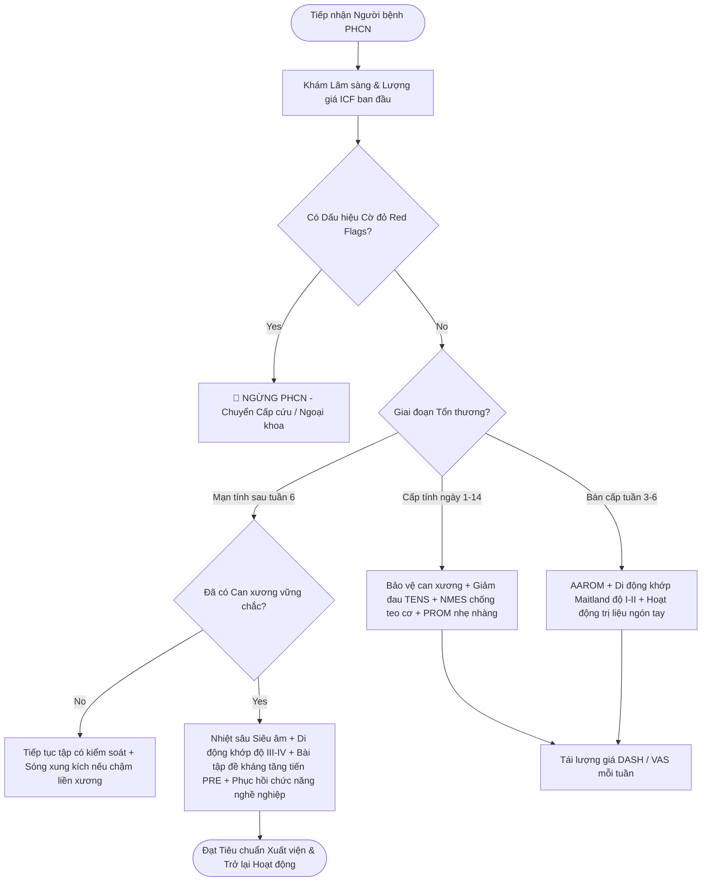

# PMR Algorithm Generator: Dựng Lưu Đồ Quyết Định Lâm Sàng

Kỹ năng này phụ trách việc trực quan hóa các hướng dẫn điều trị dài dòng thành **Lưu đồ thuật toán (Flowchart)** mạch lạc, logic bằng cú pháp **Mermaid**. Giúp học viên Đại học và Sau đại học nắm bắt nhanh các bước ra quyết định lâm sàng từ lúc tiếp nhận đến khi ra viện.

---

## Quy Tắc Thiết Kế Sơ Đồ Mermaid Chuẩn

1. **Điểm bắt đầu & kết thúc:** Dùng hình ô van/viên thuốc `([Bắt đầu / Kết thúc])`.
2. **Hành động / Can thiệp:** Dùng hình chữ nhật `[Hành động / Lượng giá]`.
3. **Điểm rẽ nhánh quyết định:** Dùng hình thoi `{Câu hỏi quyết định?}` với nhánh `Yes` và `No`.
4. **Cảnh báo khẩn cấp / Cờ đỏ:** Đặt màu sắc cảnh báo hoặc khung nổi bật.

---

## Mẫu Thuật Toán Ra Quyết Định Mẫu (Decision Tree)

